# ✨ Gravity Taproot-HTLC Atomic Cross-Chain Swap

> **Review provenance:** design from the 4-reviewer deadline-race panel + capability/hybrid
> spikes; plan deepened by 5 parallel agents (architecture/simplicity/security/impl-research/
> learnings) and technical-reviewed by kieran-python + code-simplicity + dhh. All findings are
> folded into the body below — this plan carries no separate "what the reviews said" section;
> the design *is* the synthesis. Audit-ticket tags (C1/H4/…) are kept only as inline
> cross-refs to AUDIT_REDTEAM_2026-05-24.md / the panel doc; strip them from code comments.

## Overview

Replace the Gravity **SPV-oracle** swap (which is not atomic — a plain-address BTC
payment has no refund path, so the taker can suffer one-sided loss) with a
**Taproot-HTLC atomic swap**: the BTC taker funds a single `bc1p…` Taproot output
whose script tree holds a SHA256-hashlock claim leaf (maker takes BTC with the
preimage) and a timelock refund leaf (taker recovers BTC unilaterally), while the
Radiant covenant releases the Glyph asset on the same preimage and refunds the
maker via a relative timelock. The two legs are bound by one secret, so the worst
case is **mutual refund — never one-sided loss**.

This delivers Gravity's founding "secure atomic swap with BTC" premise *without
sacrificing funding UX* (paste-and-send to one address survives), and is factored
as the **reusable cross-chain primitive**: the Radiant asset leg + secret +
timelock-ordering + state machine are chain-agnostic; the BTC Taproot backend is
one implementation, an ETH-contract backend is a later drop-in.

**Settled inputs (do not re-explore):**
- `docs/brainstorms/gravity-ref-spike/DEADLINE_RACE_PANEL_2026-05-24.md` — 4-reviewer panel + Radiant-Core capability spike + Taproot-HTLC hybrid feasibility spike (Boltz is live mainnet proof).
- `docs/brainstorms/gravity-ref-spike/AUDIT_REDTEAM_2026-05-24.md` — the off-chain trust gaps the HTLC does NOT close (carry forward).
- Memory: `project_atomic_swap_shared_primitive`, `project_gravity_redteam_findings`, `feedback_gravity_anchor_timing`, `project_nft_singleton_conservation`, `feedback_never_handwrite_test_keys`.

## Problem Statement

The shipped Gravity swap is a **one-directional SPV oracle**, not an atomic swap
(`DEADLINE_RACE_PANEL:21-22`). The taker pays BTC to a plain maker address — which
Bitcoin cannot claw back — then must land an on-chain SPV proof before a wall-clock
`claimDeadline`, or the maker reclaims via CLTV `forfeit`. If BTC blocks are slow,
the payment is mined late, or the maker sets a tight deadline, **the taker loses the
BTC and gets no asset**. `tx.time` is `>=`-only (no in-script upper-bound deadline),
so no Radiant-side change gives the taker recourse — the irreversibility is on the
Bitcoin side. A 4-reviewer panel concluded only an atomic (hashlock) binding fixes
this; bonds and maker-sig-gated forfeit were rejected (the latter introduces
permanent stranding + extortion).

## Proposed Solution

A **Taproot-HTLC atomic swap** using plain Tapscript (no Bitcoin covenant soft-fork
— CTV/OP_VAULT/APO/CSFS/CAT are all inactive on mainnet in 2026; Boltz ships this
pattern today). Radiant capabilities verified from source: Bitcoin-compatible
`OP_SHA256` (interpreter.cpp:1084), first-class `tx.age` → `OP_CHECKSEQUENCEVERIFY`
(RadiantScript utils.ts:17, BIP68 enforced), Schnorr + `checkDataSig`.

### The settled role assignment — `MAKER_SECRET_TAKER_LOCKS_BTC_FIRST` (the safety hinge)

SpecFlow analysis pinned the ONE safe, incentive-aligned direction. **This is a hard
invariant, not an implementer choice** — name it self-documentingly in code
(`MAKER_SECRET_TAKER_LOCKS_BTC_FIRST`), not "Combination #1" (the opaque insider label all
three technical reviewers flagged):

- **Maker** holds the Glyph asset (wants BTC); **Taker** holds BTC (wants the asset).
- **Maker generates the secret `p`** (32 bytes CSPRNG, fresh per swap) and publishes `H = SHA256(p)`.
- **Taker locks BTC first** (funds the P2TR HTLC).
- **Maker locks the asset second** (Radiant covenant).
- **Maker claims the BTC first**, revealing `p` in the Bitcoin witness.
- **Taker scrapes `p` from Bitcoin and claims the Radiant asset** before its refund opens.
- **Invariant: `t_BTC_refund > t_RXD_refund + margin`** — the leg claimed *second*
  (Radiant) must have the *shorter* refund window; equivalently the first-claimed
  leg (BTC) holds the longer refund. The taker's client MUST verify
  `t_BTC − t_RXD ≥ margin` **before funding**, or refuse.

Rationale (`DEADLINE_RACE_PANEL` + SpecFlow §4): this keeps the liveness-critical
second action (taker claiming the asset after `p` is public) aligned with the party
who *gains* by acting (the taker wants the asset), minimizing the one-sided-loss
path. BTC gets the longer timelock because it is the slower/harder-to-reorg chain.

### Two corrections from research that change the design

1. **Use `OP_SHA256 <H>` directly — do NOT copy Boltz's `OP_HASH160(SHA256(p))`.**
   Boltz reveals the secret on Lightning, so its BTC witness only needs to expose
   `H`. In a UTXO↔UTXO swap **the BTC witness IS the reveal channel** — the claim
   leaf must commit to the preimage so the witness pushes the real `p` that the
   Radiant leaf needs. Same single SHA256 hashlock on both chains. (best-practices
   research, [INFERENCE] flagged + sound against sources.)
2. **`tx.age`/CSV is grammar-present but UNPROVEN on-chain in this codebase** — only
   `tx.time`/CLTV is mainnet-proven. This is a **BLOCKING Phase 0 spike** with a
   CLTV fallback (Boltz itself uses CLTV absolute on its refund leg).

## Technical Approach

### Architecture

```mermaid
stateDiagram-v2
    [*] --> NEGOTIATED: H, amounts, t_RXD<t_BTC, REF, HTLC params agreed
    NEGOTIATED --> BTC_LOCKED: taker funds BTC P2TR HTLC (locks FIRST)
    NEGOTIATED --> [*]: taker never funds
    BTC_LOCKED --> BOTH_LOCKED: maker locks asset in Radiant covenant
    BTC_LOCKED --> ABORTED: maker never locks; t_BTC elapses; taker refunds BTC
    BTC_LOCKED --> PARAMS_MISMATCH: maker locks asset but on-chain covenant != negotiated terms/H
    PARAMS_MISMATCH --> ABORTED: taker refunds BTC via timelock leg (post-asset-lock re-validation, H4)
    BOTH_LOCKED --> SECRET_REVEALED: maker claims BTC with p (reveals p on Bitcoin)
    BOTH_LOCKED --> MAKER_STALLS: maker has NOT claimed and t_RXD - N approaches (C1)
    MAKER_STALLS --> ASSET_REFUNDED_TAKER_ACTS: taker refunds the asset proactively (do NOT wait)
    BOTH_LOCKED --> MUTUAL_REFUND: maker never claims; both timeouts elapse (SAFE failure)
    SECRET_REVEALED --> COMPLETED: taker scrapes p (by funding-outpoint), claims asset before t_RXD
    SECRET_REVEALED --> ASSET_VULNERABLE: taker offline / claim pinned / maker stalled p past t_RXD
    ASSET_VULNERABLE --> ONE_SIDED_LOSS_TAKER: maker refunds asset via CSV (residual; reachable ADVERSARIALLY via stall, not only offline)
    ASSET_VULNERABLE --> COMPLETED: taker still lands claim before maker refunds (winner-take-all race)
    COMPLETED --> [*]
    MUTUAL_REFUND --> [*]
    ABORTED --> [*]
    ASSET_REFUNDED_TAKER_ACTS --> [*]
    ONE_SIDED_LOSS_TAKER --> [*]
```



**The maker-stall path is the dominant adversarial risk (deepen-review C1).** Because
`t_BTC > t_RXD`, a malicious maker can withhold their BTC claim until *after* `t_RXD`
opens, then claim BTC (revealing `p`) AND refund the asset — taker loses both. The
`MAKER_STALLS` transition is the defense: the taker (or watchtower) treats "maker hasn't
claimed and `t_RXD − N` is approaching" as a trigger to **refund the asset proactively**,
never a reason to keep waiting. The honesty docs must state the loss is reachable
adversarially (a malicious maker), not only by an offline/pinned taker.

The **only** path to taker loss is `ASSET_VULNERABLE → ONE_SIDED_LOSS_TAKER`
(taker offline past `t_RXD`, or their claim pinned, or a Radiant reorg). It is
driven toward zero by margin width + a watchtower but **not provably eliminated for
an unattended party**. The guaranteed-safe failure mode is `MUTUAL_REFUND`. Per the
panel's and the global honesty rules, the plan and all docs state this plainly — no
"cannot lose / fully trustless" claim without the online/watchtower qualifier.

### Counter-chain leg — concrete class now, Protocol deferred

Ship a concrete `BitcoinTaprootLeg` with method *names* an `EthHtlcContractLeg` could later
share; extract a `Protocol` only when a 2nd backend gives a real shape (avoid speculative
generality — kieran-python: duck-typed fakes cover coordinator tests; no Protocol needed for
testability). `build_lock`/`broadcast` are **split** so the pre-funding gate fits between
(H4); `scrape_secret` lives with swap-semantics, NOT in the crypto module.

```python
# src/pyrxd/btc_wallet/taproot.py  (concrete; Radiant asset leg + FSM sit above it)
class BitcoinTaprootLeg:
    def build_lock(self, hashlock: bytes, timeout: Timelock, claim_pubkey, refund_pubkey) -> UnsignedLock: ...
    def broadcast(self, signed: bytes) -> BtcHtlcLocator: ...     # returns the durable retained-state record
    def claim_tx(self, locator: BtcHtlcLocator, preimage: bytes) -> bytes: ...
    def presigned_refund(self, locator: BtcHtlcLocator) -> bytes: ...   # built at funding time
    # confirm_depth: read via the BTC RPC directly in the coordinator — not a leg method (YAGNI)
# scrape_secret lives in swap-semantics (matches p by sha256(p)==H, disambiguates by funding outpoint).
```

### Concrete types to specify before Phase 4 (kieran-python — the plan's thin part)

Follow the repo house style (`gravity/types.py`: `frozen=True` dataclass, `__post_init__`
raising `ValidationError`, byte-length asserts). Pin these, don't leave them as adjectives:

- **`Timelock` + `TimeUnit`** — never pass raw `int` blocks/seconds. `class TimeUnit(Enum):
  BLOCKS; SECONDS`; `@dataclass(frozen=True) class Timelock(value:int, unit:TimeUnit)` with
  `normalize_to(unit, *, block_interval_s) -> Timelock`. The `t_BTC − t_RXD ≥ margin` check
  **raises** if it can't compare like units (fail-closed lives in this type, not scattered in
  the coordinator). The whole safety invariant rides on this — nail it first.
- **`BtcHtlcLocator`** — NOT opaque; it IS the durable retained state: `funding_outpoint`,
  `script_tree` (both leaves), `control_block`, `internal_key` (NUMS), `amount_sats`. The
  Phase-5 state-loss negative = "assert the whole `BtcHtlcLocator` was persisted, not a
  reduced form."
- **FSM** — states as an `Enum`, transitions as an explicit `frozenset[tuple[State,State]]`
  (the 13-state safety machine must not become string literals).
- **`NegotiatedTerms`** — `frozen` dataclass, ONE canonical wire form (hex), explicit
  `to_dict`/`from_dict`; **must NOT carry `p`** (see secret-handling).

### Secret handling (kieran-python — collides with the existing `SecretBytes` discipline)

- `p` = 32 bytes CSPRNG, held **in-memory only as `security.secrets.SecretBytes`** (the repo's
  intentionally-unpicklable, non-hashable secret type) by the **maker**; zeroized after the
  BTC claim. The **taker never persists `p`** — re-scrapes from chain.
- The durable swap state persists ONLY `H = SHA256(p)`. **`p` is excluded from
  `NegotiatedTerms`/persistence** — otherwise serializing the terms writes the secret to disk
  (and `SecretBytes` blocks pickle by design). Persistence format = JSON/hex (matches the
  `*_hex` precedent), **never pickle**.
- `sign_schnorr(msg, *, aux_rand)` — `aux_rand` is **required** (no default), 32 bytes from
  `os.urandom`; an un-defaultable arg is how nonce-reuse is prevented.
- Normalize all external byte inputs to immutable `bytes` at each module boundary, so the
  prior "guard rejected `bytearray`" bug class cannot recur downstream.

### What's REUSED vs NEW (from repo research, file:line)

**REUSE (proven on mainnet — the asset-custody half is battle-tested):**
- Glyph asset locking + hash-compare destination pin: `src/pyrxd/glyph/script.py:127` `build_nft_locking_script`, `:135` `build_ft_locking_script`; phantom-ref walker `:404` `iter_input_refs`, `:459` `count_input_refs`.
- Radiant BIP143 sighash + ref-aware output hashing: `src/pyrxd/gravity/transactions.py:96` `_compute_hash_output_hashes`, `:125` `_sign_radiant_p2sh_input`.
- Asset funding into a covenant: spike `docs/brainstorms/gravity-ref-spike/fund_nft_into_covenant.py` (reused unchanged); settle-out builders `build_nft_finalize.py`/`build_ft_finalize.py` (scriptSig changes only — preimage push instead of headers/branch/rawTx).
- Covenant build/fuse pipeline + deny-list + push-wrap guards: `src/pyrxd/gravity/covenant.py:125` `CovenantArtifact`, `:203` `substitute`; `codehash.py`.
- BTC wallet primitives: `src/pyrxd/btc_wallet/keys.py:123` `generate_keypair` (CSPRNG), bech32m encoder `:319`, BIP341 **key-path-only** P2TR tweak `:205` `_taproot_tweak`, tx scaffolding `payment.py:60-248`.
- Session/orchestration shells: `maker.py:130`, `trade.py:117` (adapt; drop the SPV proof step).
- Carrier-value fee-reserve pattern: `transactions.py:257-290`.
- Spike-harness conventions + `tr` node access + recoverable-asset rule: `gravity-ref-spike/*.py`, `BTC_RECOVERY.md`.

**NEW** (after deepen-review simplifications — concrete classes, fuse not generator, gravity/ not swap/):
- `src/pyrxd/btc_wallet/taproot.py` — the largest new chunk. Existing P2TR is
  **key-path-only address derivation** (keys.py:205 tweaks by empty merkle root); this adds:
  tagged-hash helpers (TapLeaf/TapBranch/TapTweak/TapSighash, leaf version `0xc0`),
  Tapscript HTLC leaf builders (claim `OP_SHA256 <H> OP_EQUALVERIFY <makerPk> OP_CHECKSIG`
  — direct preimage commit, NOT Boltz's HASH160; refund `<takerPk> OP_CHECKSIGVERIFY
  <timeout> OP_CSV|CLTV`), script-tree tweak (by merkle root), control-block
  construction (65 B / 2-leaf tree), BIP341 sighash + BIP340 Schnorr signing via the
  in-repo `coincurve` (`sign_schnorr`/`PublicKeyXOnly` — no new dep; hand-roll ~250 LOC,
  validate vs BIP341 test vectors, cross-check with `python-bitcoin-utils` on testnet),
  script-path spend builder, the **pre-signed refund tx** builder, and a
  **`scrape_secret(claim_txref)`** that extracts `p` by matching `sha256(candidate)==H`
  over the witness pushes — never by positional offset (C-PARSER lesson) — and
  disambiguates the claim tx by the swap's **funding outpoint** (hashlock-reuse learning).
  Internal key = **provable NUMS point** (a non-provable one lets a colluding maker
  key-path-spend the BTC without revealing `p`, silently breaking atomicity; assert in tests).
- `fuse_htlc_covenant.py` — a fuse transform (NOT a new JS generator; the cited
  `gen_maker_covenant.js` does not exist in-tree — pipeline is `fuse_*.py`). Reuses the
  FT/NFT route-tail + hardening + hash-compare destination from `fuse_ft/nft_covenant.py`
  **byte-identical** (keeps the audited code unchanged). Deltas: drop SPV ctor params
  (`btcChainAnchor`, `expectedNBits`, `merkleDepth`, …); add `bytes32 hashlock`,
  `int refundCsv`; `claim(preimage)` = `require(sha256(preimage)==hashlock)` + hardening
  + hash-compare to taker; `refund()` = `require(tx.age >= refundCsv)` + hash-compare to
  maker. **FT routes MUST settle to the exact FT code-script** (`bd d0 <genesisRef>
  dec0…`, Layer-2 conservation); **NFT covenant is Layer-1-only** (no
  `codeScriptHashValueSum` — do NOT apply the exact-code-script rule; keep
  `refOutputCount(ref)==1` singleton guard). Add a bare-`0xbd`-in-opcode-position guard
  over the new prologue. Escalate to a hand-authored `.rxd` only if a spike shows the
  regex anchors break.
- `gravity/htlc.py` — `build_htlc_claim_tx` (scriptSig pushes `<preimage>` + selector)
  and `build_htlc_refund_tx` (`tx.age` selector, v2 tx + nSequence set per BIP68),
  reusing `_sign_radiant_p2sh_input`.
- `gravity/swap_state.py` — the **pure FSM** (states, transitions, guards; no I/O) +
  the chain-agnostic negotiated-terms type (`H`, `t_BTC`, `t_RXD`, HTLC params, REF,
  amounts — the HTLC analogue of the SPV-coupled `GravityOffer`). Shared by the
  coordinator AND watchtower (single source of truth for the safety FSM). Must be
  **serializable/durable** — persisted from first lock (crash with lost state = fund loss).
- `gravity/swap_coordinator.py` — drives `swap_state` for a live participant; hard-codes
  `MAKER_SECRET_TAKER_LOCKS_BTC_FIRST`, the pre-BTC-lock gates + post-asset-lock re-validation (H4), the
  timelock-ordering check, secret generation. Adapts `trade.py`/`maker.py` *patterns*
  (polling, broadcast helper, deadline-warning), does NOT new-package; `trade.py`/`maker.py`
  stay frozen as legacy SPV-oracle.
- `gravity/swap_watchtower.py` — drives the SAME `swap_state` from chain observation:
  scrapes `p` (shared `scrape_secret`), fires the Radiant claim before `t_RXD`, fires the
  **MAKER_STALLS asset-refund** proactively, broadcasts refunds at maturity, one fee-bump
  path (CPFP/carrier-reserve for v1). Threat-modeled: minimal key custody, offset-free
  scraping, defined coordinator/watchtower de-dup. Core safety loop is v1; multi-strategy
  fee-bumping + daemon productization deferred.
- A **2-message off-chain handshake** carrying `H`, `t_BTC`, `t_RXD`, BTC HTLC params
  (RSWP orderbook extension deferred to Future — discovery is not safety).
- A `BitcoinTaprootLeg` **concrete class** (method names `lock`/`claim`/`refund`/
  `scrape_secret`/`confirm_depth`; split `build_lock`/`broadcast` so the pre-funding gate
  fits between; typed unit-tagged timelock so the cross-chain ordering check compares like
  units). The `CounterChainLeg` `Protocol` is **deferred** — extract it when an ETH backend
  gives a real 2nd shape to generalize against (avoid speculative generality).

**RETAINED but decoupled:** `src/pyrxd/spv/*` is no longer on the swap path (the
preimage replaces the SPV proof) but is kept in-tree (mainnet-proven; may anchor the
separate BTC-peg work). Remove the `trade.py:40` SPV import from the swap path.

### Implementation Phases

> **Note (deepen-review):** the original standalone "Phase 0 — `tx.age`/CSV spike" was
> folded into **Phase 2** as its blocking first gate (the CSV refund is part of the Radiant
> covenant work, not a separate phase). Phases 1 and 2 can run in **parallel** (disjoint
> code: `btc_wallet/taproot.py` vs the Radiant covenant); both only need the Phase-2 CSV
> gate's clock-unit decision frozen first. Milestones to track: the CSV go/no-go decision,
> and the Phase-4 first-real-swap. Phases 1–3 ship nothing usable alone — do not merge a
> half-built primitive to `main`.

#### Phase 1 — BTC Taproot HTLC module (`btc_wallet/taproot.py`)
- Tapscript leaves; script-tree TapTweak; control block; BIP340 Schnorr sign;
  script-path spend; pre-signed refund builder.
- Internal key: **provable NUMS point** for the non-interactive funder default
  (every spend is script-path); document Musig2 cooperative key-path as a later
  optimization (needs an online BIP327 nonce round; never reuse nonces).
- Unit tests vs BIP341 test vectors; cross-check a funded address + claim/refund
  spend on **BTC signet/testnet** before mainnet.
- Deliverable: address derivation + claim/refund spends verified on testnet.

#### Phase 2 — Radiant HTLC covenant (`fuse_htlc_covenant.py`; Phase-0 CSV gate folded in here)
- **Gate (was Phase 0): prove `tx.age`/CSV spends on Radiant mainnet** before building the
  refund route — compile a minimal `require(tx.age >= N)` covenant, prove a CSV refund
  spends on the `tr` node (`testmempoolaccept` → broadcast → confirm) **and** a premature
  refund (before `tx.age` matures, with v2 tx + nSequence per BIP68) is **rejected**. Pair
  with a CLTV-absolute fallback (Boltz uses CLTV). Freeze the both-legs clock-unit decision
  here. If CSV doesn't spend, fall back to CLTV. (deepen M1: the negative is required, not
  just the positive.)
- `fuse_htlc_covenant.py` transform (NOT a new generator): reuse `fuse_ft/nft_covenant.py`
  route-tail + hardening + audit-2026-05-24 post-asserts **byte-identical**. `claim(preimage)`
  = `require(sha256(preimage)==hashlock)` + hardening + hash-compare to taker; `refund()` =
  `require(tx.age >= refundCsv)` + hash-compare to maker.
- **FT:** both routes settle to the exact FT code-script (`bd d0 <genesisRef> dec0…`, Layer-2
  `codeScriptHashValueSum` conservation — reference the GENESIS ref). **NFT:** Layer-1 only
  (no epilogue; keep `refOutputCount(ref)==1` + `outputs.length==1` + value pin; do NOT apply
  the exact-code-script rule).
- Compile; upgraded static guard: all hardening opcodes present; exactly one genesis ref;
  no phantom; **bare-`0xbd`-in-opcode-position guard over the new prologue** (the new
  sha256/CSV/CHECKSIG opcodes must not move the `codeScriptHash` boundary); share the single
  `count_input_refs` walker. Compile-test the script-size budget (SPV body gone → smaller).
- Deliverable: CSV-proof txid; `GravityHtlcCovenant{Ft,Nft}.rxd/.artifact.json` + passing guard.

#### Phase 1 — BTC Taproot HTLC module (`btc_wallet/taproot.py`) [parallel with Phase 2]
- (See NEW-components list.) Tagged-hash + leaves + script-tree + control block + BIP341
  sighash + BIP340 Schnorr (coincurve), provable NUMS internal key, pre-signed refund,
  `scrape_secret` (match-by-`sha256==H`, disambiguate by funding outpoint). Validate vs
  BIP341 vectors; verify claim+refund spends on **BTC testnet/signet** before mainnet.
- Deliverable: funding address + claim/refund spends verified on testnet; NUMS-unspendability
  asserted in tests.

#### Phase 3 — Radiant claim/refund tx builders (`gravity/htlc.py`)
- `build_htlc_claim_tx` (preimage scriptSig), `build_htlc_refund_tx` (CSV selector, v2 tx +
  nSequence set), reusing the ref-aware signer + carrier-value fee reserve.
- On-chain prove on mainnet (recoverable assets): mint a fresh FT + NFT, lock into the HTLC
  covenant, claim with the correct preimage, refund via CSV after timeout.
- Negatives (extend the proven 5-negative suite): wrong preimage rejects; premature refund
  rejects; **FT `claim`/`refund` to a non-exact-code-script dest each reject with
  `OP_NUMEQUALVERIFY` on a real node** (Layer-2 proof); burn/clone/wrong-dest/wrong-value
  still reject.
- Deliverable: mainnet claim + refund txids; negatives all reject for the right reason.

#### Phase 4 — Swap coordinator + state machine + client safety (`gravity/swap_state.py`, `gravity/swap_coordinator.py`)
- Extract the §Architecture FSM to **pure `gravity/swap_state.py`** (no I/O) + the
  chain-agnostic negotiated-terms type; make it **serializable/durable** (persist from first
  lock — crash with lost Tapscript tree = fund loss). Coordinator drives it; hard-codes
  **`MAKER_SECRET_TAKER_LOCKS_BTC_FIRST`**.
- **Two-phase gates (deepen H4):** (a) pre-BTC-lock — REF authenticity on a *named* indexer
  (RXinDexer; check genesis txid:vout + payload hash + `gly` marker; define behavior when the
  indexer is unavailable/lagging) + `H` freshness against a **persistent** seen-store + the
  margin ordering check + maker-*promised* params; (b) **post-asset-lock re-validation** —
  when the maker locks the asset, re-check the on-chain covenant against negotiated terms + `H`;
  on mismatch (`PARAMS_MISMATCH`), refund the BTC via the timelock leg.
- **MAKER_STALLS defense (deepen C1):** the coordinator refunds the asset proactively once
  `t_RXD − N` approaches and the maker hasn't claimed — never waits.
- **Margin (deepen C2/C3):** derived in ONE clock unit, with separately-sourced terms — BTC
  inter-block tail (state the percentile + the residual-loss probability it implies), Radiant
  **reorg-depth** (sized so the asset claim is final before `t_RXD`, folding in the reorg term
  H5 flags), and the cross-chain interval conversion. **HARD GATE: any real-value mainnet swap
  uses a measured margin (both chains' block data + stated reorg depth); estimates are
  test-only.** Decide the claim-side `tx.time < t_RXD` bound (mutual-exclusion) or document the
  winner-take-all race (deepen M3).
- End-to-end mainnet swap (small recoverable amounts): happy path COMPLETED + a deliberate
  MUTUAL_REFUND + a deliberate `PARAMS_MISMATCH` refund + a `MAKER_STALLS` proactive refund.
- Deliverable: a real atomic BTC↔RXD swap settled; mutual-refund, params-mismatch, and
  maker-stall paths all proven.

#### Phase 5 — Watchtower / unattended recovery (`gravity/swap_watchtower.py`)
- Drives the SAME `swap_state`. Core safety loop (v1): scrape `p` (shared `scrape_secret`,
  by funding outpoint) → fire the Radiant claim before `t_RXD`; fire the MAKER_STALLS
  asset-refund; broadcast refunds at maturity; ONE fee-bump path (CPFP / carrier reserve).
- Threat-modeled: minimal key custody (no more than needed); offset-free scraping; defined
  client/watchtower de-dup (avoid double-broadcast / RBF self-collision).
- Retained-state requirement: BTC refund needs privkey + **full Tapscript tree + control
  block** (not just the key), or BTC strands — `MUTUAL_REFUND` is "safe" ONLY under this
  retention. Multi-strategy fee-bumping + daemon productization deferred to Future.
- Deliverable: watchtower auto-completes a swap where the taker client is offline; a
  **state-loss negative** (refund from privkey alone fails) proves the retention requirement.

## Alternative Approaches Considered (rejected by the panel)

- **Maker-signature-gated forfeit** — REJECTED: doesn't stop a malicious maker;
  introduces permanent asset stranding + an extortion lever.
- **Bonds / forfeit-delay** — supplementary only; a maker prices a bond below a unique
  NFT's value; a fixed delay never creates an upper bound.
- **Timestamp-based deadline** — miner-skewable ±2h; re-times only `finalize`, race
  relocates to `forfeit`.
- **Adaptor signatures (now)** — Radiant has no on-chain adaptor primitive; a plain
  SHA256 hashlock suffices. Adaptor sigs are an optional later optimization (privacy).
- **Keep the SPV-oracle as the swap** — it is not atomic and cannot be made so (BTC
  has no refund path for a plain-address payment). Retained only as decoupled,
  not-for-production reference (and for the separate BTC-peg work).

## Acceptance Criteria

### Functional (the swap works)
- [ ] Phase 2 gate: a `tx.age` CSV refund proven to spend on Radiant mainnet **AND** a premature refund (before `tx.age`, v2+nSequence) proven to REJECT — or the CLTV fallback proven instead.
- [ ] `btc_wallet/taproot.py`: P2TR HTLC funding address + claim + refund spends verified (testnet then mainnet); validated against BIP341 test vectors; an **odd-parity tweaked output key** test (the `keys.py:217` even-parity assumption is a latent ~50% unspendable-address bug); a **`hypothesis` fuzz of the witness parser** in `scrape_secret` (never wrong-length/wrong-hash preimage, never index-errors — the C-PARSER lesson); a **negative NUMS key-path test** (no valid key-path spend exists).
- [ ] Radiant HTLC covenant compiles via `fuse_htlc_covenant.py`, passes the upgraded static guard (+ bare-`0xbd` prologue check), fits the script-size budget.
- [ ] A real atomic BTC↔RXD swap settles end-to-end on mainnet (FT and NFT), happy path COMPLETED.
- [ ] A deliberate MUTUAL_REFUND proven (both sides recover; no one-sided loss).

### Security / flow-completeness (SpecFlow 14 + deepen-review C1/C2/C3/H1–H5/M1–M4)
- [ ] **Role `MAKER_SECRET_TAKER_LOCKS_BTC_FIRST` is hard-coded** (maker holds `p`, taker locks BTC first, maker claims BTC first, `t_BTC > t_RXD`); no implementer-selectable direction.
- [ ] **MAKER_STALLS defense (C1):** the taker/watchtower refunds the asset proactively at `t_RXD − N` if the maker hasn't claimed — never waits. A deliberate maker-stall is proven to end in `ASSET_REFUNDED_TAKER_ACTS`, not loss.
- [ ] **Margin (C2/C3):** expressed in ONE clock unit; BTC-tail term states the percentile + implied residual-loss probability; a sourced Radiant **reorg-depth** term sized so the asset claim is final before `t_RXD` (closes H5); cross-chain interval conversion shown. **HARD GATE: any real-value mainnet swap uses a MEASURED margin (both chains' block data + stated reorg depth); estimates are test-only.**
- [ ] Taker client verifies `t_BTC − t_RXD ≥ margin` and refuses funding if it can't normalize both legs to one unit (fail-closed).
- [ ] Every state in the machine (incl. `PARAMS_MISMATCH`, `MAKER_STALLS`) has a defined exit; no state strands funds with no action.
- [ ] **Two-phase gates (H4):** pre-BTC-lock (REF authenticity via a *named* indexer with genesis txid:vout + payload hash + `gly` marker + unavailable-indexer behavior; `H` freshness vs a **persistent** seen-store; margin; maker-promised params) AND **post-asset-lock re-validation** (on-chain covenant matches negotiated terms + `H`, else refund BTC). Closes `C-NFT-1`, `C-ECON-1`.
- [ ] `p` is fresh CSPRNG per swap; `H` reuse rejected for BOTH reasons (economic + collision/cross-swap-preimage-replay).
- [ ] `scrape_secret` extracts `p` by `sha256(candidate)==H` over witness pushes (never positional offset, C-PARSER lesson) and disambiguates the claim tx by the swap's **funding outpoint** (hashlock-reuse learning); coordinator re-verifies `sha256(p)==H` before firing the Radiant claim.
- [ ] Watchtower threat-modeled: minimal key custody, offset-free scraping, client/watchtower de-dup (no double-broadcast / RBF self-collision).
- [ ] FT `claim`+`refund` settle to the exact FT code-script (Layer-2); NFT covenant Layer-1-only with singleton guard intact — both asserted, not assumed-inherited.
- [ ] Internal key is a verifiably-unspendable NUMS point (no key-path spend bypassing the HTLC); BIP340 signing never reuses aux_rand — both asserted in tests.
- [ ] Retained-state enumerated: BTC = privkey + Tapscript tree + control block; Radiant = covenant script + CSV params. `MUTUAL_REFUND` "safe" qualified by this retention; a state-loss negative (refund from privkey alone fails) proves it.
- [ ] Per-chain confirmation-depth requirements stated (deeper on Radiant); ONE fee-bump path on every claim/refund leg (v1); pre-signed refund chooses fee at broadcast or uses anchor/TRUC so a fee spike doesn't strand it.
- [ ] Claim/refund winner-take-all race (M3) addressed: either a claim-side `tx.time < t_RXD` mutual-exclusion bound, or explicitly documented.
- [ ] HTLC negatives extend the proven 5-negative suite: wrong-`p`, premature refund (each chain), second-claim-after-counterparty-refund, **cross-swap replayed `H`** (shared-`H` scraper must refuse/pick-by-outpoint), FT-non-exact-code-script dest, pinning/late-claim sim — each fails for the precise expected reason.
- [ ] Docs state the residual `ONE_SIDED_LOSS_TAKER` risk plainly and note it is reachable **adversarially** (maker-stall), not only by an offline/pinned taker; MUTUAL_REFUND is the guaranteed-safe failure mode. No "cannot lose" claim without the online/watchtower qualifier.

### Quality gates (HARD)
- [ ] **External audit** of cross-chain atomicity + the timelock-ordering proof + the Radiant claim/refund covenant + the Taproot construction — before any production/mainnet-product claim. (Weightier than the FT/NFT audit: irreversible asset + real BTC + a new primitive.)
- [ ] All on-chain test assets recoverable (BTC swept back; near-deadline; the pre-signed refund is the recovery mechanism).
- [ ] Full `task ci` green; no private-project leakage in tracked docs/commits.

## Dependencies & Risks

| Risk | Likelihood | Impact | Mitigation |
|---|---|---|---|
| `tx.age`/CSV unproven on-chain here | Med | High (blocks Phase 2) | Phase 0 spike with CLTV fallback (Boltz uses CLTV) |
| SHA256-vs-HASH160 reveal trap | — | Critical | Use `OP_SHA256 <H>` directly; witness reveals real `p`. Locked in design. |
| Timelock-ordering mis-set by a malicious maker | Med | High | Client verifies `t_BTC − t_RXD ≥ margin` before funding; refuse if violated |
| Free-option (secret-holder stalls on price) | High | Med | Short timelocks within the slow-block margin; maker holds it (already controls terms); document |
| Taker offline past `t_RXD` → one-sided loss | Low (with watchtower) | High | Watchtower (Phase 5); honest residual-risk doc; MUTUAL_REFUND as safe default |
| Refund pinned / fee spike | Med | High | RBF/CPFP, BTC anchor or TRUC(v3), Radiant carrier reserve; wide margins |
| Radiant reorg un-does a shallow asset claim | Med | High | Deeper confirmation depth on Radiant before COMPLETED is final |
| REF authenticity (`C-NFT-1`) / `H` reuse (`C-ECON-1`) | Med | High | Pre-lock indexer + freshness gates (HTLC does not auto-fix these) |
| Script-size budget (covenant too big to relay) | Low | Med | SPV body removed → smaller; compile-test in Phase 2 |
| Weak test keys (the prior incident) | Low | High | CSPRNG `generate_keypair` only; gitignored throwaway harness keys |

## Success Metrics
- A real, recoverable atomic BTC↔RXD swap (FT and NFT) settled on mainnet with verifiable txids on both chains.
- A proven mutual-refund (no party loses).
- HTLC negative suite all-reject on a real node.
- External audit passed before any production claim.
- The BTC counter-chain leg is isolated behind a concrete `BitcoinTaprootLeg` (method names chosen so a `CounterChainLeg` Protocol can be extracted later); ETH-fit is **unverified until a second backend exists** — not claimed as a v1 deliverable.

## Future Considerations
- **ETH↔RXD backend** behind `CounterChainLeg` (sha256() precompile, claim/refund contract, read `p` from calldata — simpler than BTC; faster finality → smaller margin).
- **Musig2 cooperative key-path** for cheaper/private happy-path closes (BIP327; online session required).
- **Adaptor signatures** for scriptless swaps (privacy/fungibility) — optional.
- **RSWP orderbook extension** for cross-chain discovery (vs the 2-message handshake).

## References & Research

### Internal
- Settled design + capability spike: `docs/brainstorms/gravity-ref-spike/DEADLINE_RACE_PANEL_2026-05-24.md`
- Carried-forward off-chain gaps: `docs/brainstorms/gravity-ref-spike/AUDIT_REDTEAM_2026-05-24.md` (`C-NFT-1`, `C-ECON-1`, `H-ECON-2`, finalize/forfeit race)
- Asset custody (REUSE): `src/pyrxd/glyph/script.py:127,135,404,459`; `src/pyrxd/gravity/transactions.py:96,125,257-290`
- BTC wallet (REUSE/EXTEND): `src/pyrxd/btc_wallet/keys.py:123,205,319`; `payment.py:60-248`
- Covenant pipeline (`fuse_*.py` regex transforms — NO `gen_*.js` exists in-tree): `gravity-ref-spike/fuse_ft_covenant.py`, `fuse_nft_covenant.py`, `fuse_anywallet.py`; `src/pyrxd/gravity/covenant.py:125,203`; walker `src/pyrxd/glyph/script.py:459`
- Conventions: `BTC_RECOVERY.md`, `swap-order-wire-format.md`, memory `project_radiant_node_on_tr`, `feedback_never_handwrite_test_keys`

### External (best-practices research, 2026)
- Boltz Taproot Swaps (live mainnet reference): https://blog.boltz.exchange/p/introducing-taproot-swaps-putting ; boltz-core SwapTree; covclaim watchtower
- BIP341 (Taproot), BIP340 (Schnorr), BIP327 (Musig2), BIP68/112 (relative timelocks), BIP65 (CLTV), BIP431 (TRUC/v3 anti-pinning)
- Bitcoin Optech: anchor outputs, transaction pinning, timelocks
- Atomic-swap security: free-option problem, timelock-ordering, MAD-HTLC/He-HTLC (conduition.io; arxiv 2211.15804, 2508.04641)

### Provenance / honesty
- **Proven:** Glyph asset custody on mainnet (FT + NFT swaps settled); `OP_SHA256`/`tx.age`/Schnorr capability (Radiant-Core source-cited); Boltz Taproot HTLC pattern (live mainnet).
- **Designed-but-unproven:** the full HTLC flow end-to-end on this stack; the Radiant claim/refund covenant; `tx.age` spending on-chain *in this codebase* (Phase 0 gate); the watchtower; the timelock-ordering margin (ESTIMATED until measured).
